# Practical Report: Environment-Specific Configuration with Kustomize on Kind

## 1. Objectives

In simple words, this practical was about running the **same app in different environments** (dev, staging, prod) **without copying files**.

- Keep one shared "base" and small "overlays" that change only what is different.
- Deploy dev, staging and prod, plus my own QA environment.
- Follow the safe routine: **render → diff → apply → verify**.
- See how changing a config file automatically restarts the app.

**Quick glossary**
- **Kind:** a small Kubernetes cluster running on my laptop.
- **Base:** the shared files used by every environment.
- **Overlay:** a small folder that changes the base for one environment.
- **Render:** preview the final result without deploying.

---

## 2. Steps

### Step 1: Check the cluster
Created a Kind cluster with 1 control-plane and 2 worker nodes, then confirmed all 3 nodes were `Ready`.

> 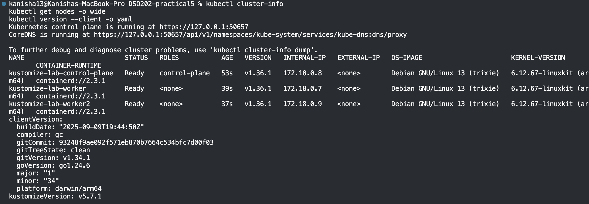`kubectl cluster-info` and `kubectl get nodes` (3 nodes Ready)

### Step 2: Look at the project layout
Checked the folder structure: one `base/` and three overlays (`dev`, `staging`, `prod`).

> 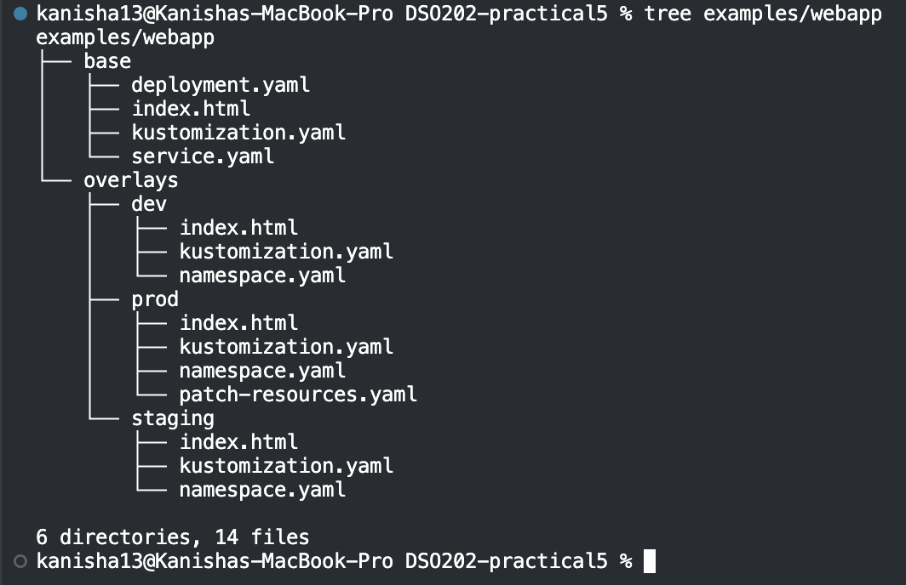`tree examples/webapp`

**What is shared vs different**
- Shared once: the `base/` files (Deployment, Service, page content).
- Different per environment: namespace, replica count, label, page text, and (for prod) resources and image version.
- Where the differences live: each overlay's `kustomization.yaml`, plus prod's patch file.

### Step 3: Render the base
Previewed the base without deploying. It produced a ConfigMap, a Service and a Deployment. The ConfigMap name got a random-looking ending (`web-content-2fd2bcctgt`).

> 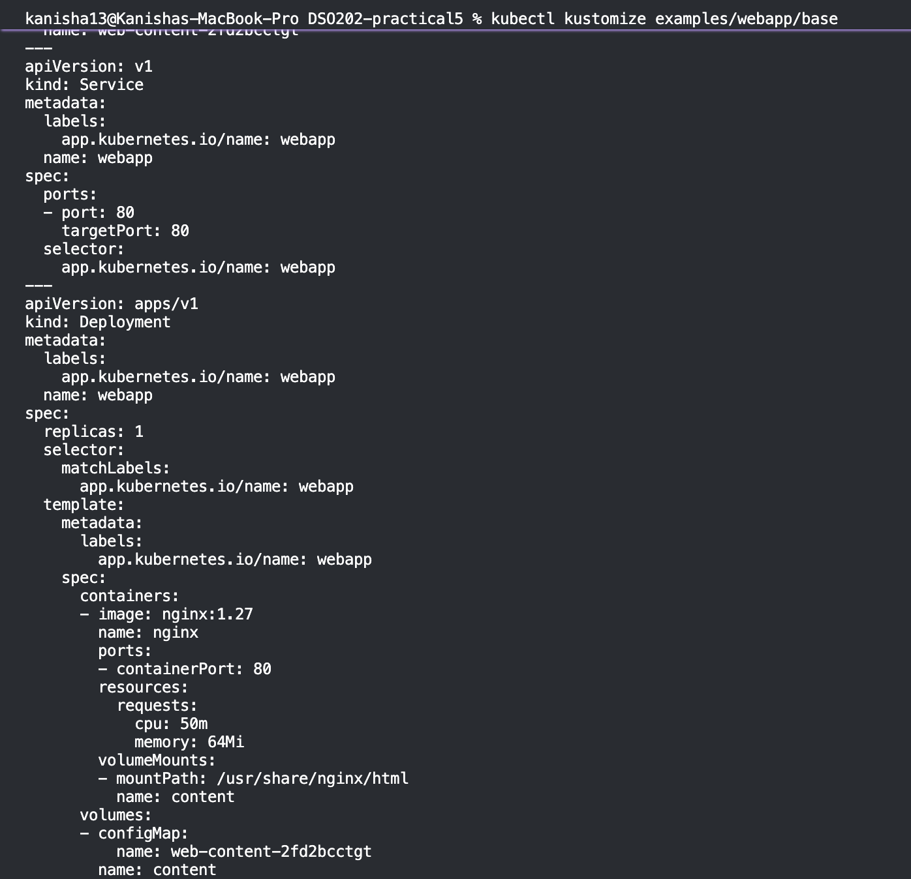 Rendered base output
> 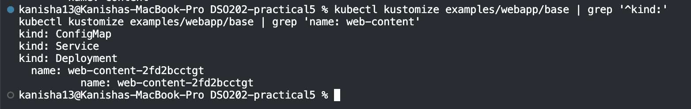 Filtered output showing the 3 kinds and the hashed ConfigMap name

**Why is the name not just `web-content`?** Kustomize adds a short code (hash) based on the file's content. If the content changes, the name changes.

### Step 4: Compare dev and prod (no deployment)
Rendered both to files and compared them. Differences found:

| Item | Dev | Prod |
|---|---|---|
| Namespace | webapp-dev | webapp-prod |
| Environment label | dev | prod |
| Replicas | 1 | 3 |
| Image | nginx:1.27 | nginx:1.27.3 |
| Resources | small requests | bigger requests and added limits |
| Page text / ConfigMap name | Development page (`6d2856b449`) | Production page (`666dmkh7hm`) |

> 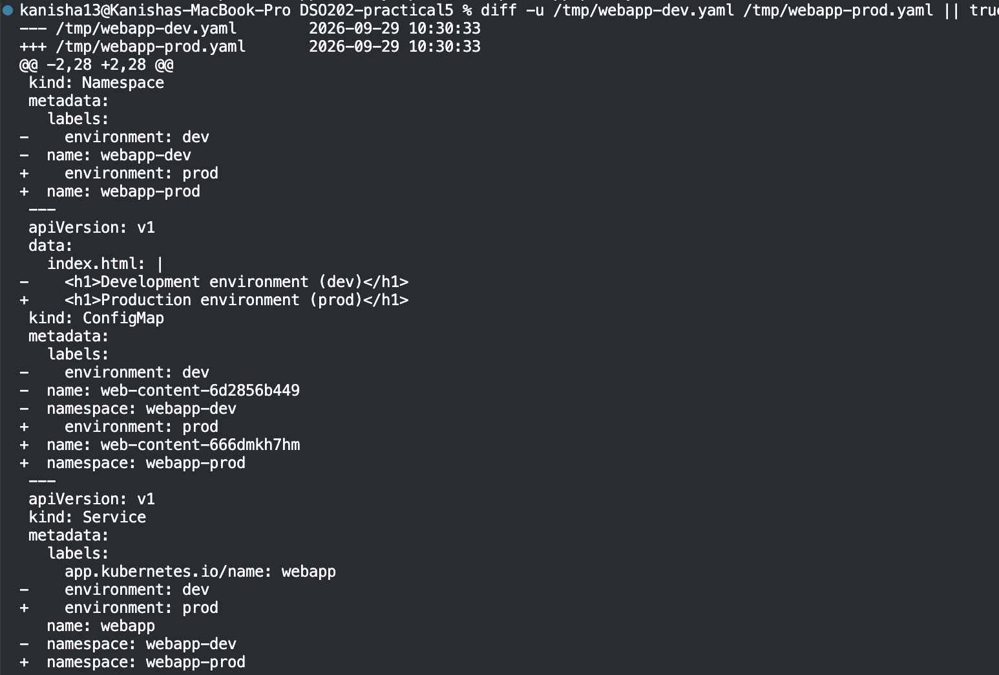 Diff output (part 1)
> 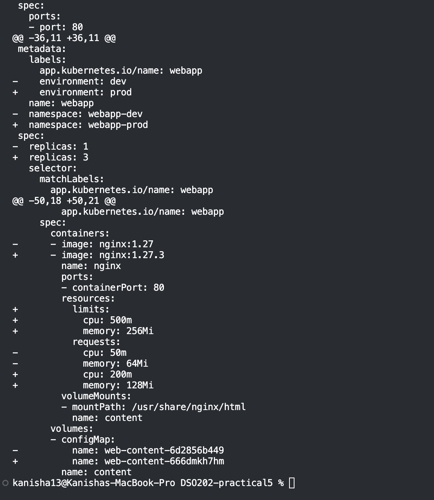 Diff output (part 2)

### Step 5: Deploy dev safely
Rendered, compared with the cluster, applied, then verified. The dev pod became `Running`.

> 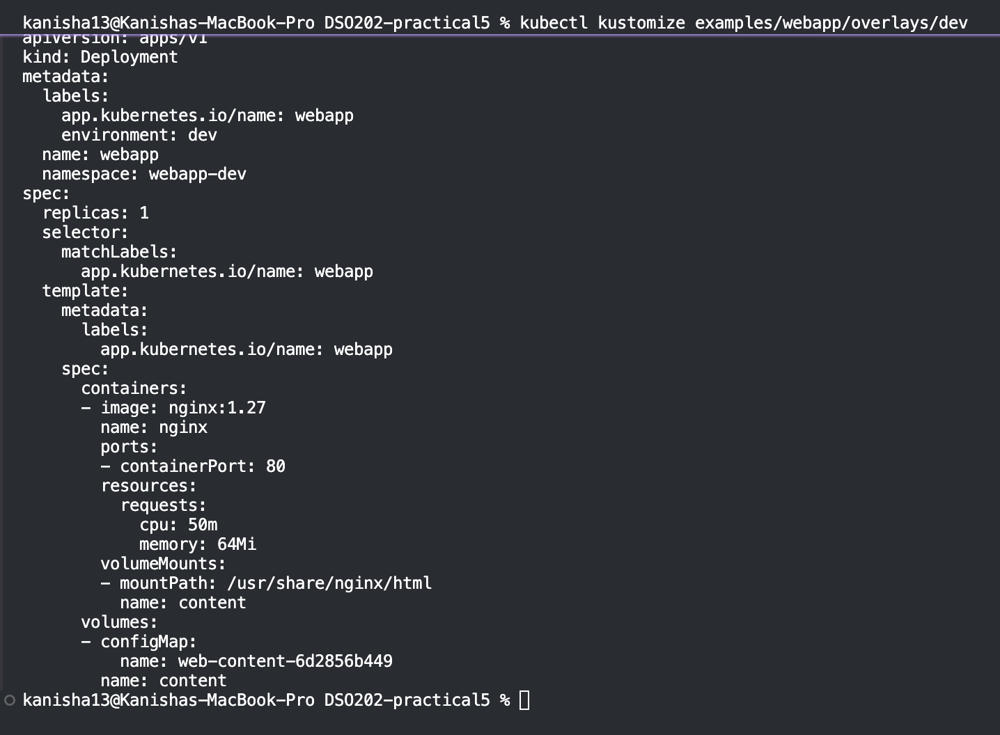 Rendered dev output
> 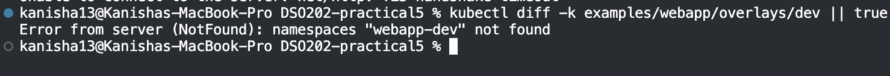 `kubectl diff` output
> 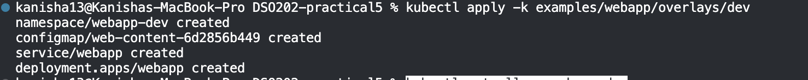 `kubectl apply` output
> 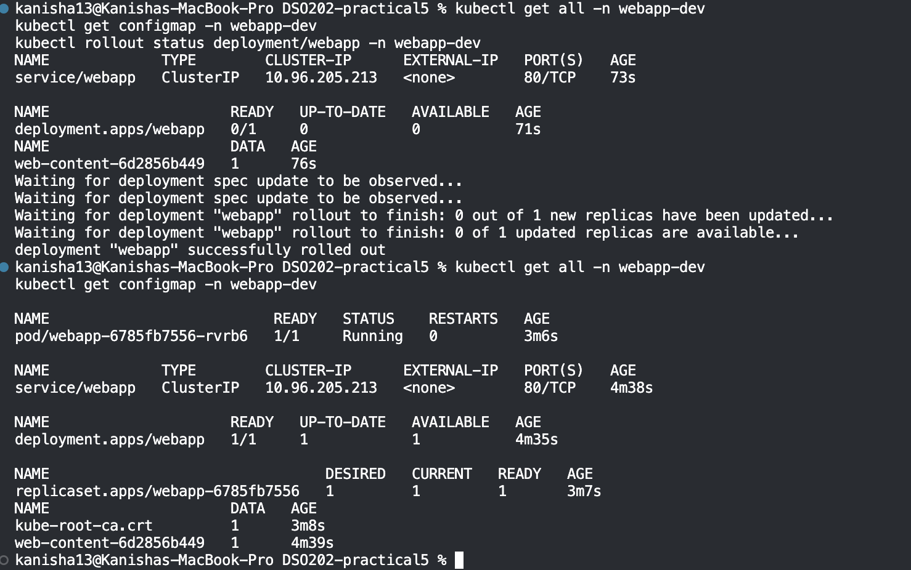 `kubectl get all -n webapp-dev`

### Step 6: Open the app
Used port-forward and `curl`. The reply was `Development environment (dev)`, so the dev overlay works.

> 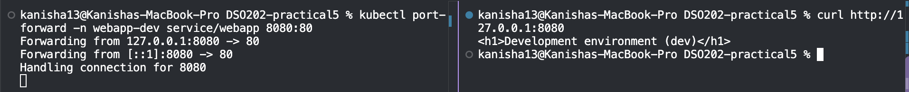 Port-forward and curl response

### Step 7: Prove the config-change chain
Changed the dev page text and applied again.

| | Before | After |
|---|---|---|
| ConfigMap | `web-content-6d2856b449` | `web-content-t7t6bd6kb8` |
| Pod | (see S11) | `webapp-7d848c6998-zm6x5` (new) |

> 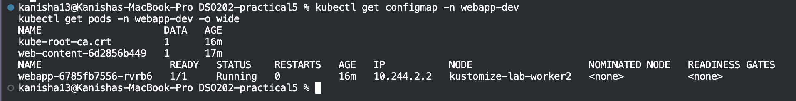 Before: ConfigMap and pods
> 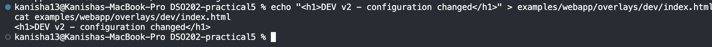 Edited page file
> 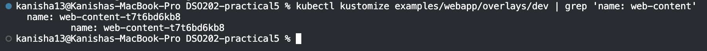 Render showing the new hash
> 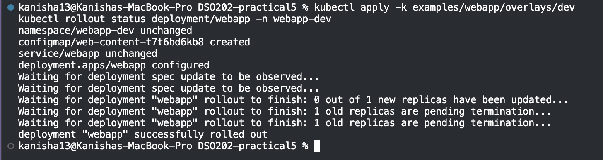 Apply and rollout
> 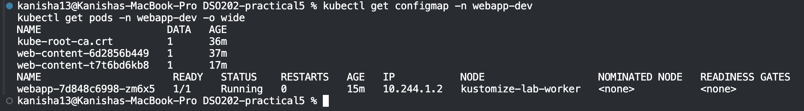 After: new ConfigMap and pod

**The chain, in plain words:**
Changing the page file → gives the ConfigMap a new name → the Deployment now points to a new name → Kubernetes sees a change → it replaces the old pod with a new one automatically.

### Step 8: Deploy staging and prod
Applied both. Final replica counts: **dev 1, staging 2, prod 3**, all `Running`.

> 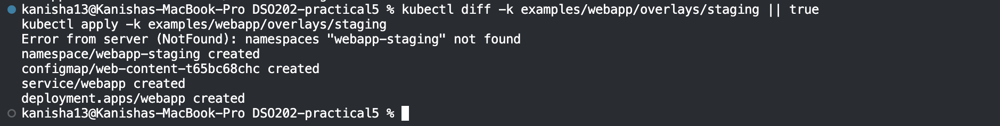 Staging diff and apply
> 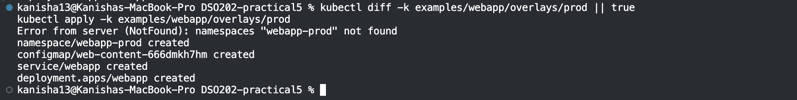 Prod diff and apply
> 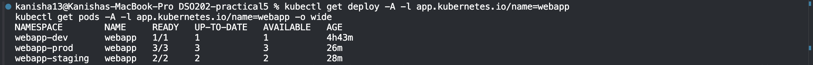 Deployments in all environments
> 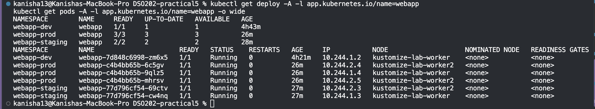 Pods in all environments (spread over both workers)

### Step 9: Inspect the prod patch
Prod's patch **merged** into the base. It changed the request values and added limits, and left everything else alone. Prod owns its own resource policy, so dev and staging are unaffected. A patch is better than copying `deployment.yaml` because it is only a few lines, and it stays correct when the base changes.

> 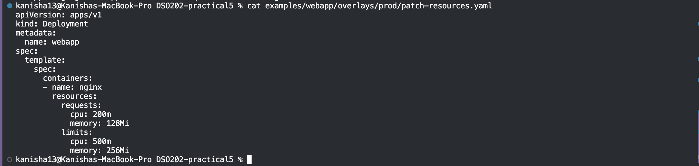 `patch-resources.yaml`
> 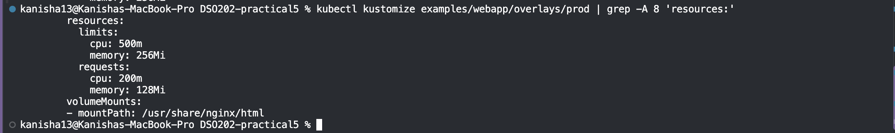 Rendered prod resources (limits and requests)

### Step 10: Create my own QA overlay
Made `overlays/qa/` with namespace `webapp-qa`, 2 replicas, label `environment: qa`, its own page, and an annotation `training.example.com/owner: qa-team`. I did not copy the Deployment or Service. Checked the annotation in the render before applying.

> 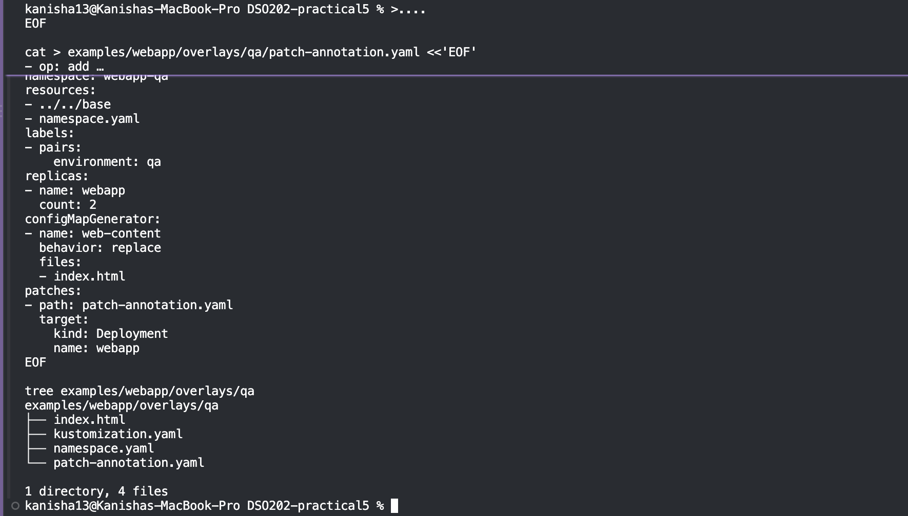 QA overlay files
> 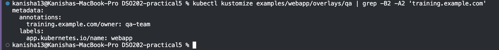 Render showing the annotation
> 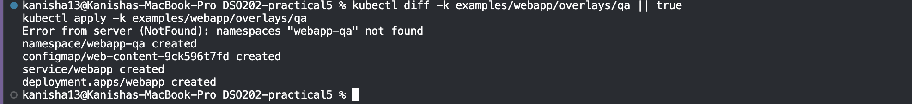 QA diff and apply
> 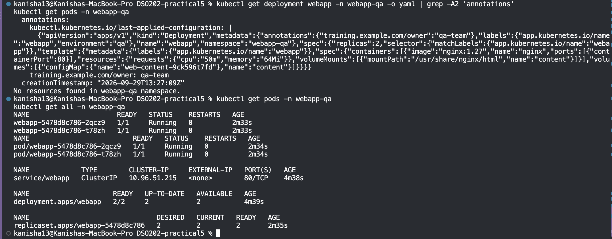 QA Deployment annotation and 2 running pods

**Two ways to patch**
- **Strategic merge** (used in prod): write a partial copy of the resource, and Kustomize merges it in. Easy to read.
- **JSON 6902** (used in QA): list exact operations (add, replace, remove) with a path. More precise, but less natural to read.

### Step 11: Clean up
Deleted dev, staging, prod and QA, then checked that no `webapp-` namespaces remained.

> 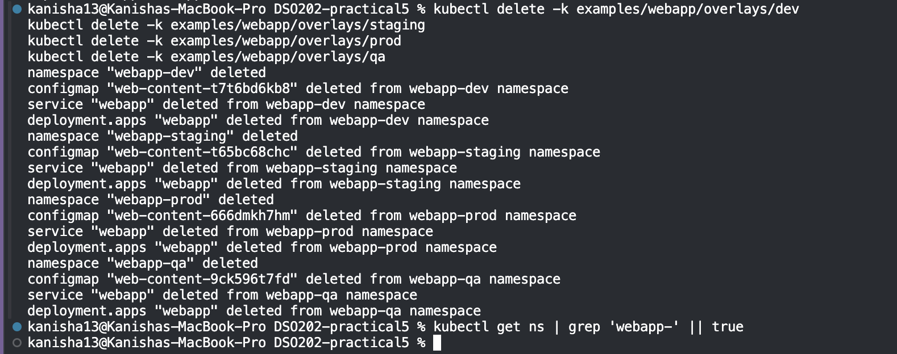 Delete outputs and empty namespace check

---

## 3. Challenges

**C1: Temporary cluster error.** `kubectl cluster-info` first showed `Forbidden: unknown` and API errors. Running it again worked, so it was a temporary glitch.

> 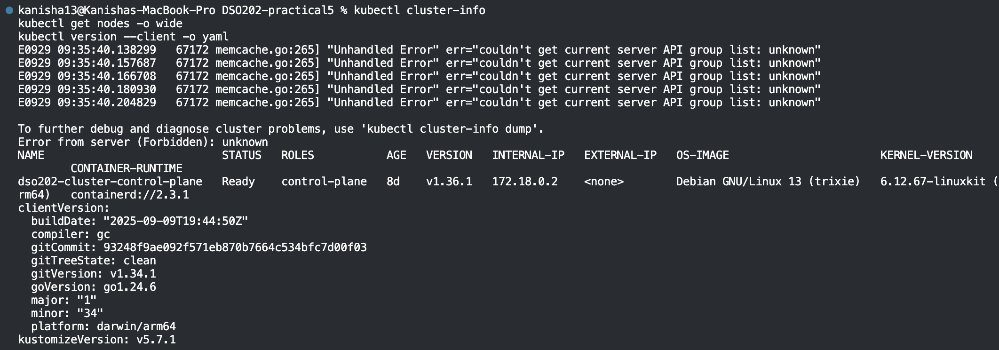 The error output

**C2: Lab folder missing.** `tree examples/webapp` said it could not open the folder because the lab files were not on my machine. I created the same base and overlay structure myself.

> 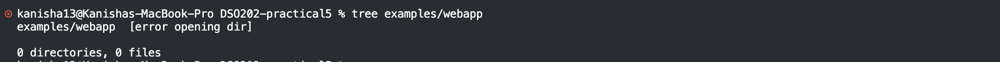 The `tree` error

**C3: Terminal parse error.** My terminal (zsh) rejected a pasted command block because of a `#` comment inside it. Part of the setup was left half-created (the base folder was missing). I removed the comments, rebuilt the base, and recreated the overlays.

**C4: Prod pods slow to start.** Right after applying prod, the 3 pods stayed in `ContainerCreating` for a few minutes. Prod uses a different image version (`nginx:1.27.3`), which had to be downloaded first. After waiting, all 3 pods became `Running`.

**Smaller notes**
- Right after applying QA, `get pods` briefly said "No resources found". A recheck a little later showed 2 running pods.
- My kubectl (v1.34) was two versions behind the cluster (v1.36). No problems came from this, but it is worth knowing.

---

## 4. Conclusion

Kustomize let me run four environments from **one shared base**, with only small overlays for what differs. Rendering before applying meant I could check the result (hash names, annotation, resources) **before** touching the cluster. I also saw that a tiny config change gives the ConfigMap a new name, which triggers an automatic pod replacement. In short: less copying, fewer mistakes, and changes I can explain by reading a few lines.

**Reflection:** My mistakes this time were in the setup (a bad pasted command and a missing folder), not in Kustomize itself. Checking outputs at every step, especially rendering before applying, made problems easy to spot and fix.